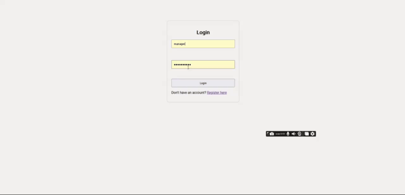

# 💬 AI Chatbot with Image Support (React + Flask + Gemini)

A full-stack AI chatbot powered by Google's Gemini 1.5 Flash model, allowing users to have dynamic conversations with support Based on Project Documentation with both text and image input. Built using React (frontend), Flask (backend), MongoDB (chat history), and JWT authentication.

---

## 🚀 Features

- 🔐 User registration and login with JWT-based auth
- 🧠 Gemini-powered chatbot responses (text + image-aware)
- 🖼️ Image input (via file upload) and response generation
- 🗃️ Chat history persistence for managers
- 📄 Dynamic Markdown rendering for responses
- 📤 Streaming response support (like ChatGPT)
- 🎨 Responsive UI with automatic scroll-to-bottom
- 🧪 Role-based access control for chat history saving

---

## 🏗️ Tech Stack

| Frontend | Backend | AI Model | Database |
|----------|---------|----------|----------|
| React    | Flask   | Gemini 1.5 Flash | MongoDB + MongoEngine |

---

## 📸 Demo



---

## 🛠️ Installation & Setup

### 🔧 Prerequisites

- Node.js & npm
- Python 3.8+
- MongoDB
- [Google AI Studio API Key](https://aistudio.google.com/app/apikey)

### 1. Clone the Repository

```bash
git clone https://github.com/mohonthecyberghost/chat-bot.git
```

### 2. Frontend Setup
```bash
cd client-react
npm install
npm start
```

### 3. Backend Setup
```bash
cd server-python
python -m venv venv
source venv/bin/activate  # Windows: venv\Scripts\activate
pip install -r requirements.txt
```

### 4. Environment Variables

Create a .env file inside the backend/ directory:
```bash
PORT=9000
JWT_SECRET_KEY=your_jwt_secret
GOOGLE_API_KEY=your_google_api_key
MONGO_DB_NAME=your_db_name
MONGO_URI=mongodb://localhost:27017/your_db_name
```

### 5. Start Flask Server
```bash
python app.py
````

## 🧪 API Endpoints
```bash
Method	Endpoint	Description
POST	/register	Register a new user
POST	/login	        Authenticate and get JWT token
POST	/chat	        Non-streaming chat w/ image support
POST	/stream	        Streaming chat (text-only input)
```
## 📂 Project Structure
```bash
├── backend/
│   ├── app.py
│   ├── models/
│   ├── docs/project_docs.txt
├── frontend/
│   ├── src/
│   │   ├── components/
│   │   ├── App.css
│   │   ├── ChatPage.js
│   └── public/
│       └── assets/
└── README.md
```


## ✅ Roles & Permissions
```bash
Role	Can Save History	Can Upload Images
user	❌	                   ✅
manager	✅	                   ✅
```

## 🤖 AI Model Info

    Model: gemini-1.5-flash

    Capabilities: Text & Image input, Image output (rendered via  tag or data:image/png;base64,...)

    API: Google AI Studio

## 🧠 How Image Support Works

    User uploads an image (.png, .jpg, etc.)

    Flask receives and forwards it as PIL image to Gemini

    Gemini responds with context-aware answers


## 🛡️ Security

    JWT authentication used to protect chat routes

    CORS enabled for development

    Secure storage of environment variables

## 📌 To-Do
```bash
Add voice input support

Enhance image generation via prompt

Dockerize the project

Role-based UI management
```

## 🙌 Acknowledgements

    Google Generative AI

    React Markdown

    MongoEngine

    Flask-JWT-Extended
    

## 👨‍💻 Developer Info
```bash
Sazzad Ahmmed Mohon 
sazzad.mohon@konasl.com
📱 +8801717581031
```

## 📃 License

This project is licensed under the MIT License.


---


